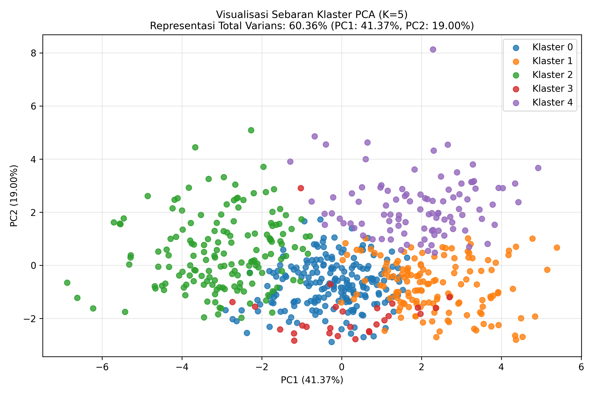

# WebGIS Clustering Dashboard

[](https://www.python.org/)
[](https://www.djangoproject.com/)
[](https://scikit-learn.org/)

## 📌 Ikhtisar Proyek
Proyek ini merupakan sistem **Dashboard WebGIS** terintegrasi yang dirancang untuk melakukan segmentasi wilayah (Kecamatan) berdasarkan performa elektoral (Perolehan Suara & Partisipasi Pemilih). Menggunakan pendekatan **Machine Learning - Unsupervised Learning (K-Means Clustering)**, sistem ini membantu pemangku kepentingan dalam memetakan zonasi strategis wilayah (kecamatan) secara objektif dan berbasis data.

---

## 🔬 Metodologi Penelitian (CRISP-DM)
Penelitian ini menggunakan kerangka kerja **CRISP-DM** (*Cross-Industry Standard Process for Data Mining*) sebagai alur analisis data, yang meliputi tahapan berikut:

1. **Business Understanding**: Identifikasi kebutuhan analisis, tujuan penelitian, dan parameter utama yang digunakan dalam pengelompokan wilayah.
2. **Data Understanding**: Memahami struktur, karakteristik, dan kualitas data elektoral serta partisipasi pemilih pada tingkat kecamatan.
3. **Data Preparation**: Melakukan pembentukan atribut clustering dan normalisasi data menggunakan *Z-Score* untuk menyamakan skala antar fitur.
4. **Modeling**: Menerapkan algoritma *K-Means Clustering* serta menguji beberapa kandidat jumlah klaster menggunakan *Elbow Method*, *Silhouette Score*, dan *Davies-Bouldin Index*.
5. **Evaluation**: Mengevaluasi hasil clustering melalui profiling klaster, visualisasi *heatmap*, dan reduksi dimensi menggunakan **PCA** (*Principal Component Analysis*) untuk membaca pola sebaran data dan titik indikator batas.
6. **Deployment**: Mengintegrasikan hasil clustering ke dalam sistem **WebGIS** berbasis Django untuk penyajian hasil analisis secara spasial.

---

## 🚀 Fitur Utama
- **Dashboard Geospasial**: Menampilkan sebaran klaster wilayah melalui peta interaktif berbasis GeoJSON dan Leaflet.
- **Analisis Clustering**: Mendukung proses pengelompokan wilayah menggunakan algoritma K-Means berbasis Scikit-Learn.
- **Profiling dan Heatmap**: Menyajikan karakteristik masing-masing klaster dalam bentuk ringkasan parameter dan visualisasi heatmap.
- **Visualisasi PCA**: Menampilkan sebaran data hasil clustering pada ruang dua dimensi serta membantu identifikasi titik indikator batas.
- **Ekspor Hasil Analisis**: Mendukung ekspor hasil pengolahan dan clustering ke format Microsoft Excel.

---

## 🛠️ Stack Teknologi
- **Backend**: Python 3.11 dan Django
- **Pengolahan Data**: Pandas, NumPy, dan Scikit-Learn
- **Visualisasi**: Matplotlib, Seaborn, dan Leaflet.js
- **Basis Data**: MySQL
- **Antarmuka Sistem**: Bootstrap dan Jazzmin

---

## 📂 Struktur Repositori
- `/clustering/`: Berisi notebook dan skrip analisis clustering.
- `/core/`: Berisi konfigurasi inti proyek Django.
- `/geojson/`: Berisi data spasial batas wilayah.
- `/templates/`: Berisi template antarmuka dashboard dan visualisasi.
- `/apps/`: Berisi modul-modul data elektoral, seperti `pilpres`, `pilgub`, `pileg_ri`, `pileg_prov`, `pileg_kokab`, dan `pilwalbup`.

---

## 💻 Cara Instalasi

1.  **Clone Repositori**:
    ```bash
    git clone https://github.com/farisali522/gisclustering.git
    cd gisclustering
    ```

2.  **Siapkan Environment**:
    ```bash
    python -m venv venv
    source venv/bin/activate  # atau venv\Scripts\activate di Windows
    pip install -r requirements.txt
    ```

3.  **Migrasi Database**:
    ```bash
    python manage.py migrate
    ```

4.  **Jalankan Server**:
    ```bash
    python manage.py runserver
    ```

---

## 📊 Hasil Analisis (Preview)
| Analisis Titik Terluar (Fokus) | Sebaran Klaster Keseluruhan (PCA) |
| :---: | :---: |
|  |  |

---

## 📝 Lisensi
Proyek ini dikembangkan untuk tujuan penelitian elektoral dan analisis data wilayah.
